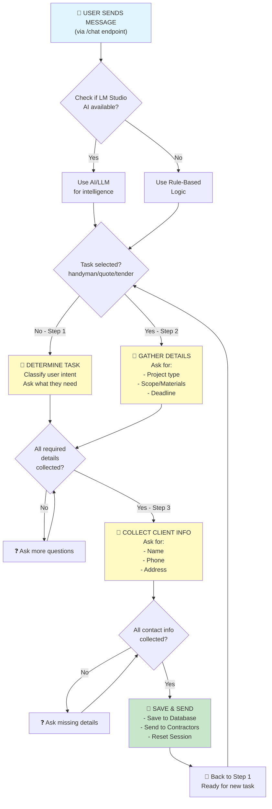

# HandymanTenderMaker Backend Overview

## 🎯 Simple Explanation (Non-Technical)

This is the **brain** of an AI chatbot called **BuildWizard AI** that helps people request handyman services, construction quotes, or contractor bids. It:

1. **Talks to users** via a chat interface
2. **Asks smart questions** to understand what they need (e.g., "Is this a plumbing issue?")
3. **Collects their contact info** (name, phone, address)
4. **Saves their request** and sends it to local contractors
5. **Uses AI** (LM Studio) to have intelligent conversations, with a backup rule-based system if AI isn't available

---

## 🏗️ Technical Breakdown: Objects & Procedures

### **Core Objects:**

| Object | Purpose |
|--------|---------|
| **AgentState** | Stores conversation data: messages, selected task, collected details, client info |
| **ChatRequest** | What the user sends: message + optional image |
| **ChatResponse** | What the bot replies with: response text + task type + collected details |
| **AVAILABLE_TASKS** | Dictionary of 3 task types: Quote Request, Tender Request, Handyman Request |

### **Main Procedures (Functions):**

| Function | What It Does |
|----------|-------------|
| `get_llm()` | Checks if LM Studio AI is running; if yes, returns AI client |
| `determine_task()` | Rule-based: reads keywords to guess what user wants |
| `llm_determine_task()` | AI version: uses LLM to classify user intent |
| `gather_info()` | Rule-based: asks questions to fill in missing details |
| `llm_gather_info()` | AI version: intelligently extracts info from user responses |
| `llm_collect_client_info()` | AI version: extracts name, phone, address |
| `get_matching_contractors_text()` | Searches DB for contractors matching the job |
| `wizard_workflow()` | Main router: decides which step to run next |
| **REST API endpoints** | `/api/categories`, `/api/contractors`, `/chat` |

---

## 📊 Flow Diagram

---

## 📝 Appendix: Libraries Used

| Library | Purpose |
|---------|---------|
| **FastAPI** | Web framework for creating REST APIs |
| **Pydantic** | Data validation & type checking (BaseModel classes) |
| **CORSMiddleware** | Allows frontend (different domain) to call backend |
| **httpx** | Makes HTTP requests (checks if LM Studio is running) |
| **langchain_openai** | AI client to communicate with LM Studio LLM |
| **json** | Parse/format JSON responses from LM |
| **re** | Regular expressions (extract JSON from LM responses) |
| **python-dotenv** | Load environment variables from `.env` file |
| **pyodbc/ODBC** | Connect to MS SQL Server database |
| **uvicorn** | ASGI server to run FastAPI app |

---

## 🔌 Database Connection
The app connects to **Microsoft SQL Server** with two connection methods:
- **SQL Server Authentication** (username/password)
- **Windows Authentication** (trusted connection)

Default database: `HandymanDB`
