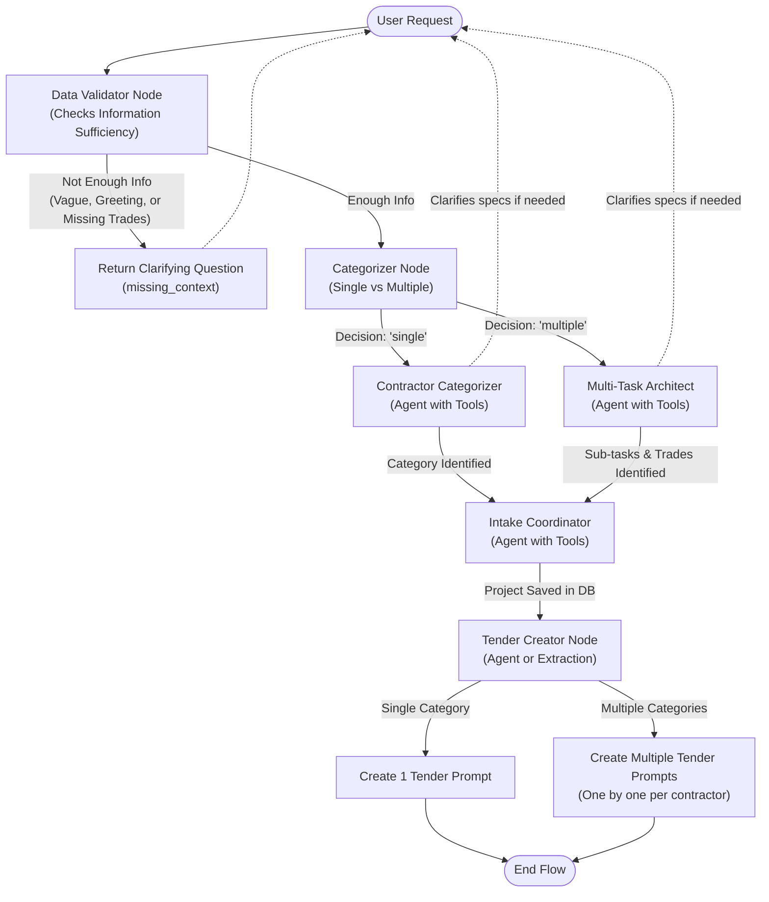

# Tender Creation Flowchart & Architecture

Based on our conversation and the new Two-Node Split architecture, I have mapped out the entire flow starting from the User Request and ending with the Tender Creation. Below is the visual flowchart diagram and the detailed specifications for every node in the LangGraph.

## Flowchart Diagram

## Node Definitions & Types

Here is the breakdown of what each node requires, and whether it should be a single-pass extraction or an Agent with tools:

### 1. Data Validator Node (Entry Point)
*   **Type**: Single-pass extraction (using LLM `with_structured_output`).
*   **Task**: Evaluates the raw input. Flags greetings, vague requests, or discrepancies (like describing a multi-trade problem but asking for a single trade). Outputs a status of `enough_information` or `not_enough_information`, and a `missing_context` string.
*   **Transitions**: 
    *   If `not_enough_information` ➔ Appends `missing_context` as an AI message and routes to `END` (waiting for the user to reply).
    *   If `enough_information` ➔ `Categorizer Node`.

### 2. Categorizer Node
*   **Type**: Single-pass extraction (using LLM structured output).
*   **Task**: Takes a request that has already passed the Data Validator and determines if the task requires a "single" professional or "multiple" professionals. (Note: Confidence scoring has been completely removed).
*   **Transitions**: 
    *   If `single` ➔ `Contractor Categorizer`.
    *   If `multiple` ➔ `Multi-Task Architect`.

### 3. Contractor Categorizer Node (Handles Single path)
*   **Type**: Agent with Tools (`fetch_available_categories`).
*   **Task**: Handles the "single" professional path. It uses its tool to find the right category ID. If the user's request is ambiguous (e.g. "Fix my kitchen" could be a handyman or a cabinet maker), it is allowed to pause and ask the user a clarifying question.
*   **Transitions**: Once the exact category is identified ➔ `Intake Coordinator`.

### 4. Multi-Task Architect Node (Handles Multiple path)
*   **Type**: Agent with Tools (`fetch_available_categories`).
*   **Task**: Handles the "multiple" professional path. It uses its tool to see available trades, breaks the project into sub-tasks, and assigns a trade to each sub-task. If the scope is too vague, it can ask the user clarifying questions. Outputs the final JSON list of sub-tasks and their respective trades.
*   **Transitions**: Once tasks and trades are identified ➔ `Intake Coordinator`.

### 5. Intake Coordinator Node
*   **Type**: Agent with Tools (`save_client_and_project`).
*   **Task**: Pre-loads any known client info from the DB. Only asks the user for missing info (Name, Phone, Address) or asks to confirm the address. Once confirmed, it uses its tool to save the parent `Project` in the database.
*   **Transitions**: After saving the project ➔ `Tender Creator`.

### 6. Tender Creator Node
*   **Type**: Agent (for natural language prompt generation) OR Single-pass script.
*   **Task**: Reads the identified categories/sub-tasks. 
    *   If single contractor: Generates 1 tender prompt connected to the project.
    *   If multiple contractors: Iterates through the sub-tasks and generates a dedicated tender prompt for *each* contractor one-by-one.
*   **Transitions**: ➔ `END`.
