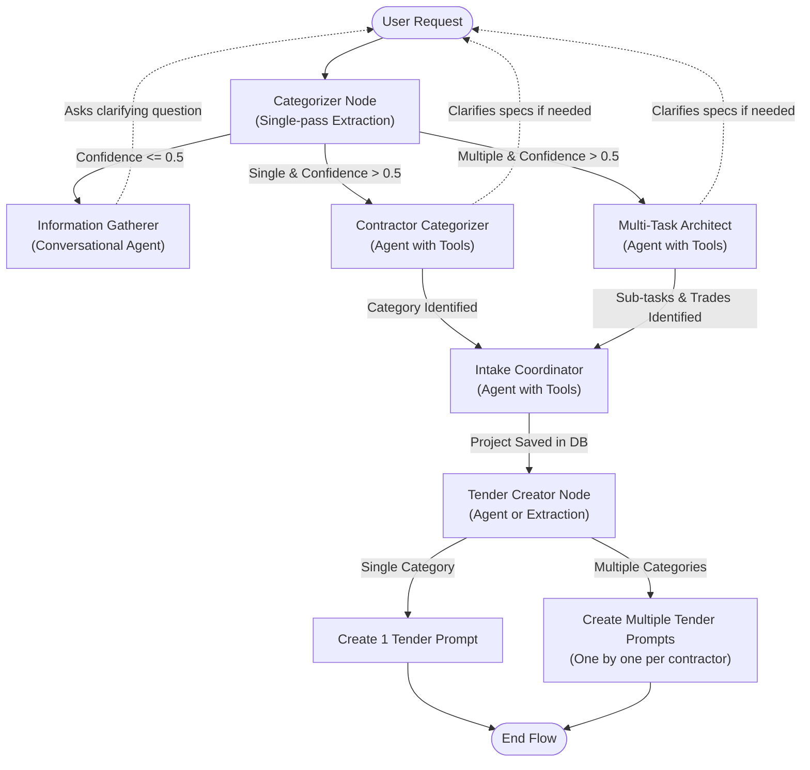

# Tender Creation Flowchart & Architecture

Based on our conversation, I have mapped out the entire flow starting from the User Request and ending with the Tender Creation. Below is the visual flowchart diagram and the detailed specifications for every node we need in the LangGraph.

## Flowchart Diagram

## Node Definitions & Types

Here is the breakdown of what each node requires, and whether it should be a single-pass extraction or an Agent with tools:

### 1. Categorizer Node (Existing)
*   **Type**: Single-pass extraction (using LLM structured output `json_schema`).
*   **Task**: Analyzes the user's initial request to output a `decision` ("single" or "multiple") and a `confidence` score (0.0 to 1.0).
*   **Transitions**: 
    *   If `confidence <= 0.5` ➔ `Information Gatherer`
    *   If `decision == "single" and confidence > 0.5` ➔ `Contractor Categorizer`
    *   If `decision == "multiple" and confidence > 0.5` ➔ `Multi-Task Architect`

### 2. Information Gatherer Node (New)
*   **Type**: Conversational Agent.
*   **Task**: When the Categorizer isn't confident, this node sends a clarifying question to the user (e.g., "Could you please provide more details about the plumbing issue?"). It then ends the graph run, waiting for the user to reply.
*   **Transitions**: Back to the `Categorizer` once the user responds.

### 3. Contractor Categorizer Node (New / Replacing Architect for Single path)
*   **Type**: Agent with Tools (`fetch_available_categories`).
*   **Task**: Handles the "single" professional path. It uses its tool to find the right category ID. If the user's request is ambiguous (e.g. "Fix my kitchen" could be a handyman or a cabinet maker), it is allowed to pause and ask the user a clarifying question.
*   **Transitions**: Once the exact category is identified ➔ `Intake Coordinator`.

### 4. Multi-Task Architect Node (Modifying Existing Architect)
*   **Type**: Agent with Tools (`fetch_available_categories`).
*   **Task**: Handles the "multiple" professional path. It uses its tool to see available trades, breaks the project into sub-tasks, and assigns a trade to each sub-task. If the scope is too vague, it can ask the user clarifying questions. Outputs the final JSON list of sub-tasks and their respective trades.
*   **Transitions**: Once tasks and trades are identified ➔ `Intake Coordinator`.

### 5. Intake Coordinator Node (Existing)
*   **Type**: Agent with Tools (`save_client_and_project`).
*   **Task**: Pre-loads any known client info from the DB. Only asks the user for missing info (Name, Phone, Address) or asks to confirm the address. Once confirmed, it uses its tool to save the parent `Project` in the database.
*   **Transitions**: After saving the project ➔ `Tender Creator`.

### 6. Tender Creator Node (New)
*   **Type**: Agent (for natural language prompt generation) OR Single-pass script.
*   **Task**: Reads the identified categories/sub-tasks. 
    *   If single contractor: Generates 1 tender prompt connected to the project.
    *   If multiple contractors: Iterates through the sub-tasks and generates a dedicated tender prompt for *each* contractor one-by-one.
*   **Transitions**: ➔ `END`.
